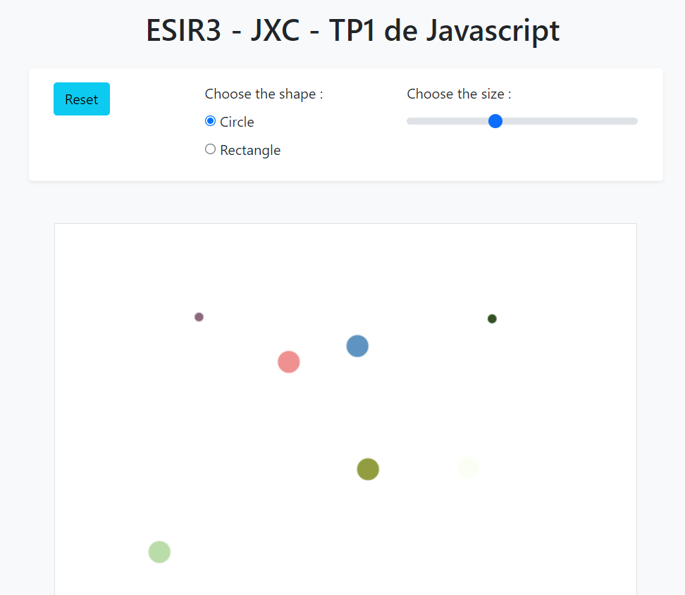

# JXC TP1 Javascript


Le but du TP est de développer une première application web en JavaScript avec mise en place d’un MVC (Modèle-Vue-Contrôleur) côté front.  Au cours de ce TP, vous allez créer une zone de dessin où vous pourrez interagir avec différentes formes géométriques, i.e. créer des formes, les déplacer ou encore en modifier la couleur. 

Voici un exemple de rendu possible : 

<p style='text-align: center'>
    
</p>

Vous pouvez vous inspirer de ce design ou le modifier à votre convenance tant que toutes les fonctionnalités sont respectées. 


## Structure

Le projet va être composé de différents fichiers. Le fichier `index.html` est un document `HTML5` décrivant le visuel du programme : il possèdera entre autres l’élément HTML5 `Canvas` pour représenter la zone de dessin, divers types de boutons afin de sélectionner par exemple le type ou la taille de la forme à créer. Ce document va également importer les documents `JavaScript` nécessaires à l’exécution du programme Web et les fichiers liés à l’utilisation de `Bootstrap` pour gérer le design. Vous n’êtes pas obligé d’utiliser Bootstrap pour la mise en page. 

Les autres fichiers JavaScript vont être utilisés pour représenter l’architecture MVC : `model.js`, `view.js`, `controller.js` et `interaction.js`. Ce patron d’architecture IHM organise la structure du programme en 3 composants : 

- **Le Modèle** : définit le modèle de données du programme. Dans le cadre du TP, les concepts de la zone de dessin (e.g. dessin, forme) seront définis ainsi que leurs propriétés (e.g. couleur, taille). Le modèle ne doit pas dépendre d’une quelconque librairie graphique et est indépendant des possibles représentations graphiques.
- **La Vue** : représentation graphique possible du modèle (plusieurs vues d’un même modèle sont possibles). Pour le TP, la vue va consister à peindre les formes du modèle dans un l’élément HTML5 canvas. 
- **Le Contrôleur** : partie interactive du patron. Il transforme les interactions réalisées par l’utilisateur en commandes qui vont modifier le modèle (modification de la position ou couleur d’une forme).  


## JavaScript - Consignes supplémentaires

**Emplacement du code JavaScript :**

Toutes les lignes de code JavaScript se situeront dans des fichiers externes au code HTML. Attention à l’emplacement et à l’ordre des balises `<script>` dans votre document HTML. En fonction des options de votre balise `<script>`, le code JavaScript sera automatiquement exécuté lorsque le navigateur arrivera au niveau de la balise.  

**Définition des objets :**

Au cours de ce TP, vous n’utiliserez pas la notion de **class** en JavaScript. Vous utiliserez les fonctions constructrices et les prototypes. 

**Gestion d’évènement :**

Vous utiliserez la méthode `addEventListener()` pour écouter un évènement et le gérer : 

```shell
canvas.addEventListener('mousedown', this.fctMouseDown);
```

Le premier paramètre est le nom de l’évènement pour lequel nous voulons enregistrer ce gestionnaire. Le deuxième paramètre correspond à la fonction que nous souhaitons exécuter en réponse. 

Les différents concepts qui vous seront utiles au cours du TP ont été expliqué dans le cours.  Vous pouvez également vous aider de ces liens pour comprendre et approfondir ces différentes notions :

- https://developer.mozilla.org/fr/docs/Learn/JavaScript/Objects/Object_prototypes

- https://developer.mozilla.org/fr/docs/Learn/JavaScript/Building_blocks/Events

- https://developer.mozilla.org/fr/docs/Web/JavaScript/Reference/Global_Objects/Function/bind

La plupart des navigateurs fournissent des outils de développement très utiles. Pour exemple sous Firefox, vous pouvez accéder au menu Développeur Web qui référence un ensemble d’outils intégrés au navigateur comme par exemple la Console web (que vous pouvez utiliser pour le TP). 


## Fichier HTML

Le fichier html va être composé de plusieurs parties : 
- une partie pour l’entête où le titre du TP sera marqué, 
- une autre partie pour les différentes options de création des formes (choix de la taille, choix de la forme, nettoyage du canvas), 
- une autre partie contenant l’élément `canvas` et pour finir,
- un pied de page contenant votre nom et prénom. 

**Etape 1**

Compléter le fichier `index.html`. Vous être libre de choisir les différents types de boutons pour le choix de la forme et la taille de la forme. Vous pouvez par exemple utiliser des boutons radios (`<input type="radio">`) pour le type de forme et un slider pour la taille de la forme (facteur multiplicateur par rapport à une taille initiale) (`<input type="range">`). 
Pour rappel, vous pouvez utiliser Bootstrap pour la mise en page web (e.g. choix des couleurs, disposition sous forme de grille). 

**Etape 2**

Le fichier `index.html` contient tout le code html. Il ne contient pas de code JavaScript et ne permet pour l’instant pas d’interaction avec l’utilisateur. Regarder le fichier `main.js`. La variable `myDrawingGame` permet de récupérer en JavaScript l’élément canvas et possède une fonction `start()` qui récupère le contexte du `canvas` (pour pouvoir ajouter entre autres les formes) et fixer sa taille par rapport à la fenêtre du navigateur. 

La ligne : `window.onload = startDrawing;` permet de gérer l’évènement `load` de la fenêtre. A la fin du processus de chargement du document, c’est à dire lorsque tous les éléments du DOM sont chargés, la fonction `startDrawing()` est appelée. 

Modifier l’appel de cette fonction pour utiliser un écouteur d’évènement (méthode `addEventListener`).
Modifier une des lignes du fichier `main.js` afin vérifier la mise en page de votre fichier html. Il doit y avoir marqué dans la console de votre navigateur : `start !`. 

En fonction de l’affichage souhaité, vous pouvez modifier les caractéristiques de votre canvas. 


## Modèle

Une fois le design de votre page HTML réalisé, vous allez développer le modèle de l’application web (au sens du MVC). Ce modèle représente un dessin composé d’un ensemble de forme. Ces formes peuvent être soit un rectangle, soit un cercle. 

**Etape 3**

Dans le fichier `model.js`, créer les quatre fonctions constructrices suivantes : **Drawing**, **Shape**, **Circle** et **Rectangle**. 

L’objet **Drawing** possède une liste de Shape.
Une forme possède les coordonnées *x* et *y* de son centre, une couleur et un objet de type *Path2D*. 
Un cercle, en plus des données de forme, possède un rayon. 
Un rectangle possède une largeur et une longueur. 
Au fur et à mesure du déroulement du TP, des attributs et fonctions pourront être ajoutés à ces objets (dans le cas de l’animation des formes par exemple). 

**Etape 4**

Tester la création de différents objets dans le fichier `main.js`. Compléter la première partie de la fonction `testDrawing()`. 

**Etape 5**

Dans le fichier `main.js`, décommenter la ligne dans la fonction `start()` concernant la création de l’objet `this.drawing` et compléter la. 


## Vue

Pour rappel, la vue est une représentation graphique possible du modèle. Notre modèle est déjà contenu dans un composant graphique. Nous allons donc dans la vue dessiner les différentes formes sur le canvas. 

**Etape 6**

Dans le fichier `view.js`, ajouter au prototype de tous les objets une méthode `paint()`. Cette méthode prend en paramètre le contexte du canvas. 
Les méthodes des objets de type **Circle** et **Rectangle** permettront de dessiner la forme géométrique. Elles serviront à créer le _Path2D_ (mise à jour de l’attribut path), définir la forme du path (méthode `rect()` ou `arc()`) et le dessiner via la méthode `stroke()` du contexte). 
La méthode `paint()` de **Drawing** permettra de dessiner toute la liste de formes. 

**Etape 7**

Tester la création d’une forme et son affichage sur le canvas dans le fichier `main.js`. Compléter la fin de la méthode `testDrawing()`. 


## Interaction

Dans cette partie, nous allons développer l’interaction homme-machine liée à la création d’une forme sur le canvas. A chaque clic gauche de la souris sur le canvas, une forme est créée. 

**Etape 8**

Dans le fichier `interaction.js`, créer une fonction **CreateShape** permettant de créer un objet. Cette fonction prendra un canvas en paramètre d’entrée. Ce modèle contiendra deux attributs initialisés à 0 représentant les coordonnées du point de la souris sur le canvas. Ces deux attributs seront utilisés plus tard lors de la création des objets **Rectangle** ou **Circle**. 

**Etape 9**

Dans la définition de l’objet, ajouter une fonction gérant l’évènement lié au clic gauche de la souris : fonction `onMouseDown`. Cette fonction prend en paramètre d’entrée un attribut evt correspondant à l’évènement produit lors de l’utilisation de la souris. Vous pouvez y extraire les coordonnées *x* et *y* et les convertir dans le repère du canvas. Pensez à utiliser la fonction `getMousePosition(canvas, evt)` donnée dans le fichier (attention au type de retour). 

**Etape 10**

Ajouter un écouteur d’évènement au canvas pour cet évènement (méthode `addEventListener`). 

**Etape 11**

Vous allez maintenant tester cette méthode. Ajouter à la fin de la fonction un `console.log()` avec comme paramètre d’entrée le point du canvas récupéré. Dans la fonction de test du fichier `main.js`, exécuter **CreateShape** sur la zone de dessin et tester le résultat dans la console de votre navigateur. 


## Contrôleur

Nous avons créé la vue, le modèle et récupéré l’action déclenchée par l’utilisateur. Nous allons maintenant faire le lien entre cette action et la vue. Nous allons rendre l’application interactive en définissant un interacteur. Dans le TP, l’interacteur sera un pointeur. L’utilisateur manipule un pointeur (via la souris) pour ajouter des formes au dessin. 

Dans le fichier `controller.js`, la fonction **Pointeur** permettra de construire le modèle de cet objet. Ce pointeur est paramétrable.        

**Etape 12**

Implémenter la fonction **Pointeur** qui possèdera les attributs suivants : 
- la forme courante, 
- le type de la forme (si c’est un rectangle ou un cercle qui doit s’afficher sur le canvas), 
- sa couleur,
- son ratio de taille (qui vaut 1 par défaut). 

**Etape 13**

Lier l’interaction **CreateShape** au **Pointeur**. Vous devez créer dans **Pointeur** un objet **CreateShape**. 
Il vous faut également dans la fonction  **CreateShape** ajouter un paramètre d’entrée correspondant à un interacteur (le pointeur). Ajouter également à la fonction `onMouseDown` un appel à la fonction `interactor.onInteraction (this)`. Cette fonction n’existe pas encore, mais elle a pour but de notifier l’interacteur d’une réalisation d’un évènement. 

**Etape 14**

Vous allez maintenant dans le prototype de **Pointeur** ajouter la fonction `onInteraction(…)`. Dans cette fonction, vous allez créer une forme en fonction de la valeur des attributs de **Pointeur**.  Cette forme sera ajoutée à la liste des formes de **Drawing** et sera ensuite dessinée sur le canvas. A chaque appel de cette fonction, donc à chaque création de forme, la couleur du pointeur va changer. Utiliser la fonction `randomColor()` qui permet de retourner une couleur rgba générée aléatoirement. 

https://www.w3schools.com/cssref/func_rgba.asp

**Etape 15**

L’utilisateur peut également choisir un autre type de forme ou encore changer la taille de la forme via les widgets fournis (boutons, spinner, etc.). Dans **Pointeur**, prendre en compte les changements possibles de ces valeurs. 

**Etape 16**

Tester si votre interaction fonctionne en ajoutant des formes au canvas via un clic gauche. Afficher l’élément créé dans la console de votre navigateur ainsi que la liste des formes. Pensez à créer votre objet dans la fonction `start()` du fichier `main.js`. 


## Déplacement de formes

Vous avez maintenant réussi à créer une application web en JavaScript qui utilise l’architecture MVC. Vous allez maintenant compléter votre programme pour pouvoir : 
- nettoyer le canvas (supprimer l’affichage et supprimer toutes les formes), 
- donner un mouvement à vos formes. 

**Etape 17**

Via un clic sur un bouton, le canvas va pouvoir se réinitialiser. Pour effacer le contenu du canvas vous pouvez appeler sur le contexte du canvas la fonction `clearRect(...)`. Pensez aussi à réinitialiser la liste de formes contenu dans Drawing. 

**Etape 18**

Maintenant que vous avez un moyen pour réinitialiser le canvas sans recharger la page, vous pouvez réaliser un déplacement des formes. Lisez toute cette partie avant de commencer à implémenter votre code. 

Les formes vont pouvoir se déplacer sur le canvas grâce à une action de l’utilisateur : un appui sur la touche **m** du clavier. 

Modifier les fichiers `interaction.js` et `controlleur.js` pour pouvoir gérer cette interaction. Dans le premier fichier, ajouter une fonction `onKeyPress` pour prendre en charge l’appuie sur la touche **m**. Dans le deuxième fichier, ajouter au **Pointeur** la fonction `onInteractionAnimate` qui va permettre déplacer la forme (modification des coordonnées de la forme pour que la vue puisse ensuite la dessiner). 

Les formes vont se déplacer jusqu’à ce que l’utilisateur appuie de nouveau sur la touche **m**. Afin de prendre en charge le déplacement continu des formes, vous devez appeler la fonction `window.requestAnimationFrame(callback)` dans la fonction `onInteractionAnimate`. Cette fonction va notifier au navigateur que nous souhaitons réaliser une animation et lui demander d’appeler la fonction callback passée en paramètre d’entrée afin de mettre à jour l’animation avant de dessiner la prochaine image sur le canvas. Notre fonction callback va s’appeler `animate()`. Dans cette fonction, nous allons calculer le nouvel emplacement de nos formes si elles doivent se déplacer. 

Comme vous vous en doutez, le modèle doit être également complété afin de pouvoir réaliser le déplacement de vos formes. Ajouter à tous vos objets formes :
-	Des attributs *dx* et *dy* qui seront initialisés aléatoirement entre –1, 0 et 1. A chaque appel de la fonction callback `animate`, ces deux valeurs seront ajoutées aux coordonnées des centres de nos formes. 
-	Un attribut *gravity* pour représenter la gravité. Elle sera fixée à 0.01 pour chaque forme. 
-	Un attribut *gravitySpeed* initialisé à zéro qui sera incrémenté avec la valeur de *gravity* à chaque appel de `animate`. Cet attribut sera ajouté à la coordonnée *y* de l’élément pour représenter l’attraction. 
-	Un attribut *bounce* pour gérer le rebond de nos formes. Nous fixerons cet attribut à 0.80. Il ne sera utilisé que si notre forme atteint le bord de notre canvas :
```shell
element.gravitySpeed = -(element.gravitySpeed * element.bounce);
```

Dans un premier temps, prenez en compte dans votre fonction `animate` que le déplacement de vos formes avec les attributs *dx* et *dy*. 

Puis, gérer les collisions avec les bords de votre canvas par rapport au centre de vos formes (coordonnées *x* et *y*). 

Une fois les collisions gérées, ajouter la gravité (via l’attribut *gravitySpeed*) à votre forme. Une fois l’accélération obtenue, réaliser le rebond. 

https://developer.mozilla.org/fr/docs/Web/API/Window/requestAnimationFrame

## Autres modifications 

Si vous avez le temps, vous pouvez ajouter d’autres fonctionnalités.

**Etape 19**

Modification de la couleur des formes lors du survol de la souris sur celles-ci.

**Etape 20**

Ajout d’autres formes (triangle, ellipse, polygone ou autre). 